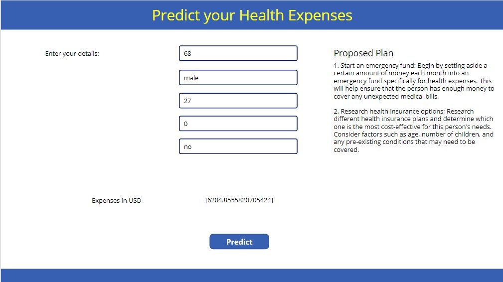

# Health Expense Planner

## Summary

This app allows the user to predict their Health Expense using a Machine Learning Model and then get a detailed personalized plan to save funds for it.

|Starting Screen|Output 1 |Output 2 |
:-------------------------:|:-------------------------:|:-------------------------:
 |  | 

## Features

This app allows the user to:

* Predict Health expenses based on various parameters like age, sex, bmi, number of children and whether they are a smoker or not
* Uses a custom built Azure Auto ML model integrated to Power Apps using Power Automate Flow
* Provides a customized plan to save for health expenses based on inputs and the result of the model using Open AI's API

## Prerequisites

You need to get an API key from [OpenAI](https://platform.openai.com/)

## Solution Components

* App (Interface)
* Azure Auto ML Flow (Power Automate flow)
* Azure Auto ML Model for predictions
  

## Details

### Open AI API
This apps connects to the Open AI API and uses the information to create a health expense plan

### Power Automate Flow
Uses a Power Automate Flow to pass the input to the model and get the results back.

* The flow uses HTTP to POST the inputs to the Model Endpoint
* It then uses Parse JSON to parse the output
* Finally sends it back to the Power App

A screenshot for the flow:

### Azure Auto ML Model

#### Data Exploration:
 |  | 

#### Model:
 |  |  | 

Deployed Model Endpoint URL: [Link](http://c692c678-bd90-41d8-ac5f-5d1d140d196e.centralindia.azurecontainer.io/score)

Deployed App URL: [Link](https://apps.powerapps.com/play/e/cf46801e-aa6d-4a32-a161-692e900c34cc/a/6f7695e5-11d7-4fa1-96e9-bd0aae6bd6f7?tenantId=84c31ca0-ac3b-4eae-ad11-519d80233e6f)

